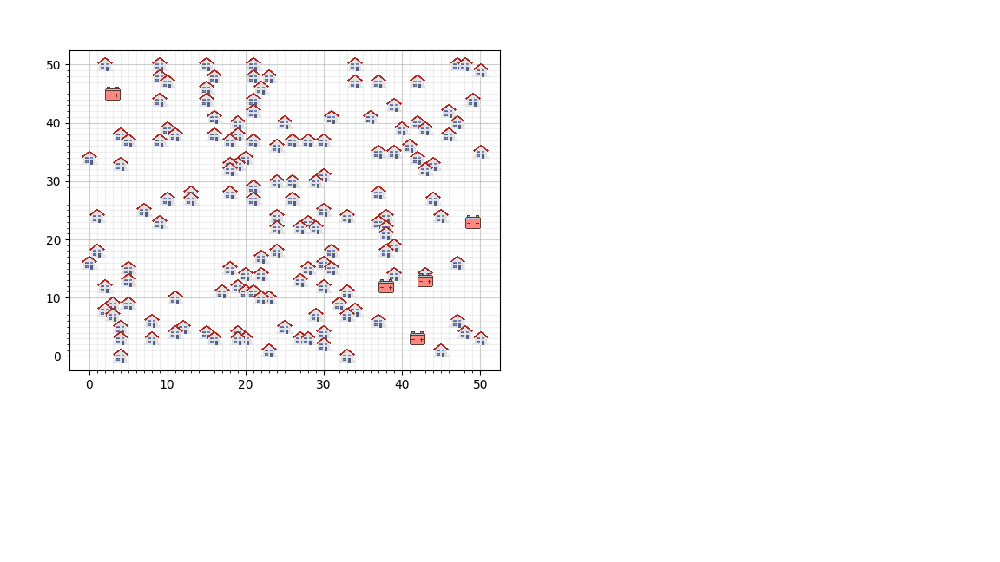

## Vergelijking effectiviteit van  algortitmes tussen wijken
Hieronder is per wijk de verdeling van de kosten van de oplossingen weergegeven. Voor de random resultaten en de hillclimber op deze resultaten zijn 20000 resultaten gegenereerd

Wijk 1

Wijk 2
  

Wijk 3

### Vergelijking
Zoals te zien is in de figuren zitten de oplossingen het dichtste in de buurt bij de lower bound. Dus voor deze wijk hebben we de beste oplossingen.

Daarnaast lijkt het gat tussen de laagste oplossing en de lower bound het grootste bij wijk 1.

Verder valt het op dat voor wijk 3 er heel veel resultaten dezelfde kosten hebben (richting de 8000).
Voor kunnen we niet nagaan of deze oplossingen exact hetzelfe zijn maar dit duidt er in ieder geval op dat er een beperkte hoeveelheid oplossingen zijn voor deze wijk.

Onze vraag is: wat is de oorzaak van deze verschillen in de case?
Dus welke factoren bepalen of onze algoritmes dicht in de buurt van de lowerbound kunnen komen of niet?

|                 | Wijk 1 | Wijk 2 | Wij    |
| --------------- | ------ | ------ | ------ |
| Lower bound     | 53188  | 45268  | 42757  |
| Beste oplossing | 56230  | 45628  | 42757  |
| Difference      | 5,41%  | 0,79 % | 2.58 % |

Er zijn een aantal factoren die bepalen hoe makkelijk het probleem aan te pakken is

met onze oplossing. De belangerijkste zijn:

- De posities van de batterijen vergeleken met de huizen
- De spreiding van de capaciteiten van de huizen

## De posities van de batterijen

Laten we naar wijk 1 kijken

In dit plaatje zijn 4 van de 5 batterijen erg bij elkaar in de buurt. Dit zorgt ervoor dat velen huizen een lange grid afstand zullen hebben en daardoor ook een hoge lower bound heeft. Om te vergelijken hoe 'handig' de batterijen geplaatst zijn kijken we naar de lower bound van de grid kosten. Vervolgens kijken we naar lower bound na dat de batterijen met K_means optimaal geplaatst zijn.

|               | Wijk 1 | Wijk 2 | Wijk 3 |
| ------------- | ------ | ------ | ------ |
| Before K_mean | 53188  | 45268  | 42757  |
| After K_means | 39490  | 40102  | 40615  |
| Difference    | 25.7%  | 11.4%  | 5.0 %  |

Het is duidelijk dat wijk 1 veel 'onhandigere' posities heeft voor de batterijen vergeleken met 2 en 3.

## De spreiding van de capaciteiten

Als je huizen vergelijkbare capaciteiten hebben, heb je een kleinere marge om wissels te maken met een Hill Climber. De wijken hebben ook hele andere verdelingen voor de spreiding van de capaciteiten.

Wijk 1

Wijk 2

Wijk 3

Zoals als hier te zien is, wijk 3 heeft een erg smalle sprijding vergeleken met 1 en 2. De aantal stappen is ook het best voor wijk 2.

|                                               | Wijk 1 | Wijk 2 | Wijk 3 |
| --------------------------------------------- | ------ | ------ | ------ |
| Mogelijke  stappen met Hill climber | 72     | 134    | 84     |

### Variatie in oplossingen
Wanneer je kijkt naar hoe de huizen zijn aangesloten tussen verschillende goede oplossingen dan zie je dat er een zeer grote variatie is tussen de oplossingen in wijk 1. In wijk 2 en vooral wijk 3 lijken de oplossingen veel meer op elkaar.

Een goede oplossing is: de beste gevonden oplossing na 20000 iteraties random + hillclimber

|                 | Wijk 1 | Wijk 2 | Wijk 3    |
| --------------- | ------ | ------ | ------ |
| Variatie | 64.66  | 10.25  | 0  |

Dit geeft aan dat wanneer de spreiding van de output van de huizen laag is er ook minder mogelijke oplossingen zijn, daarnaast lijkt het ook zo te zijn dat wanneer de batterijen niet efficient geplaatst zijn dit ook voor meer variatie in de oplossingen.
