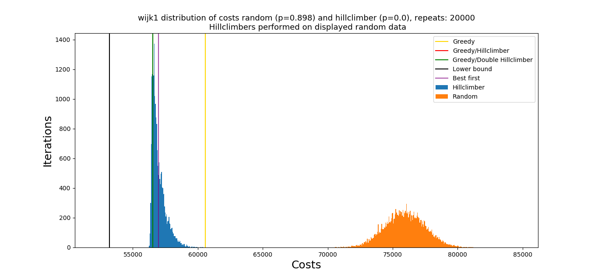
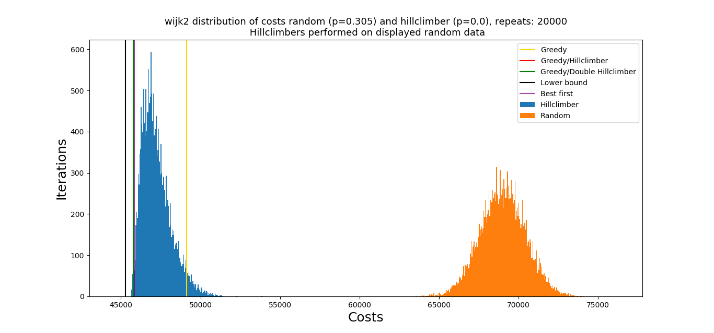
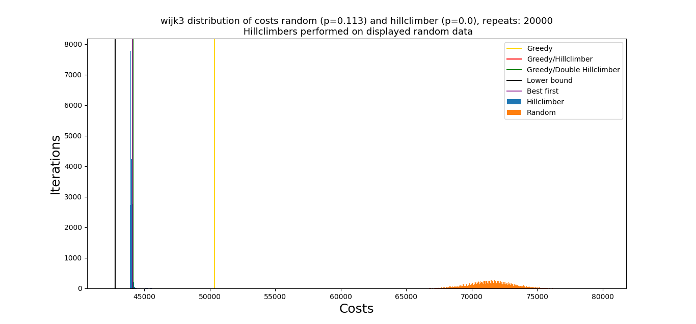
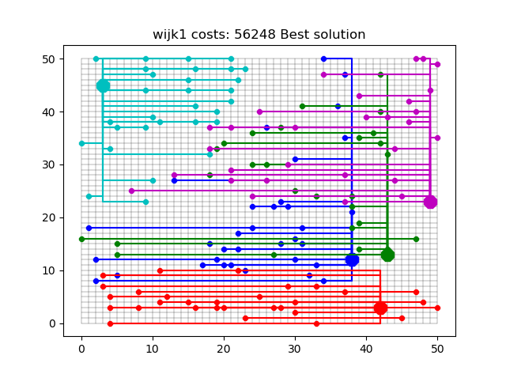
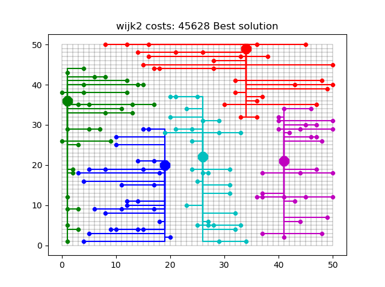
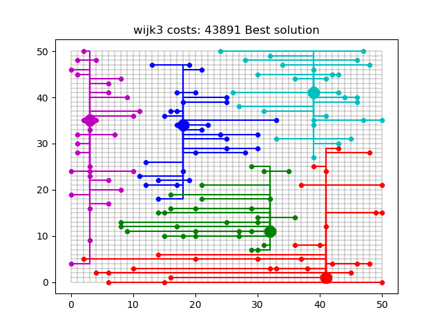
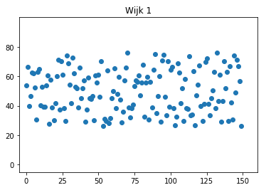
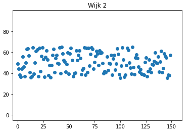
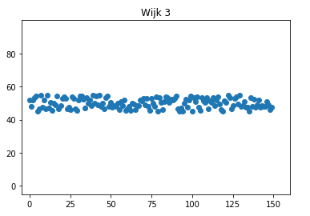

<!-- # SmartGrid December 2018
Philip Oosterholt
Mohamed Baioumy
Thomas Hoedeman -->

# Waarom zijn sommige wijken moeilijker op te lossen dan anderen?

## Vergelijking effectiviteit van algortitmes tussen wijken
Hieronder is per wijk de verdeling van de kosten van de oplossingen weergegeven. Voor zowel de random resultaten als de hillclimber zijn 20000 resultaten gegenereerd.

  

### Vergelijking
Zoals te zien is in de figuren zitten de oplossingen in wijk 2 het dichtste in de buurt bij de lower bound. Het lijkt er dus op dat we voor deze wijk de beste oplossing hebben gevonden. Daarnaast lijkt het gat tussen de beste oplossing en de lower bound groot is bij wijk 1 en in mindere mate bij wijk 3. In de tabel hieronder is weergegeven wat de relatieve afstand is van de best oplossing naar de lower bound. We bespreken zo waarom we denken dat dit zo is.

Verder valt het op dat voor wijk 3 er heel veel resultaten dezelfde kosten hebben (richting de 8000). Later in dit documenten bespreken we de variaties in de oplossingen.

|                 | Wijk 1 | Wijk 2 | Wijk 3    |
| --------------- | ------ | ------ | ------ |
| Lower bound     | 53188  | 45268  | 42757  |
| Beste oplossing | 56230  | 45628  | 43891  |
| Difference      | 5,41%  | 0,79 % | 2.58 % |

Er zijn een aantal factoren die bepalen hoe makkelijk het probleem aan te pakken is met onze oplossing. De belangerijkste zijn:

- De posities van de batterijen vergeleken met de huizen
- De spreiding van de capaciteiten van de huizen

## De posities van de batterijen

Om dit te illustreren kunnen we naar wijk 1 kijken in vergelijking met wijk 2 en 3:

Bij wijk 1 zien we dat 4 van de 5 batterijen erg bij elkaar in de buurt. Dit zorgt ervoor dat velen huizen een lange grid afstand zullen hebben en daardoor ook een hoge lower bound heeft. Om te vergelijken hoe 'handig' de batterijen geplaatst zijn kijken we naar de lower bound van de grid kosten. Vervolgens kijken we naar lower bound na dat de batterijen met k means optimaal geplaatst zijn.

|               | Wijk 1 | Wijk 2 | Wijk 3 |
| ------------- | ------ | ------ | ------ |
| Before K_mean | 53188  | 45268  | 42757  |
| After K_means | 39490  | 40102  | 40615  |
| Difference    | 25.7%  | 11.4%  | 5.0 %  |

Het is duidelijk dat wijk 1 veel 'onhandigere' posities heeft voor de batterijen vergeleken met 2 en 3.

Omdat 4 van de 5 batterijen bij elkaar liggen in een hoek, en de andere precies aan de tegenovergestelde kant ligt, zullen veel huizen die niet meer bij de ene batterij in de rechterhoek passen, waardoor ze een lange afstand moeten overbruggen naar de andere batterijen. Voor de lower bound maakt dit niets uit, want de helft van de huizen ligt het dichtsbij de batterij in de rechterhoek. Maar omdat we deze huizen niet alleemaal kunnen verbinden met deze batterij raken we ver van de lower bound verwijdert. Je kunt daarom ook wel zeggen dat onze oplossing niet per se slechter is, maar de sprijding van de huizen en batterijen het maakt dat we per definitie nooit dicht in de buurt van de lower bound kunnen komen (althans, hoe we deze nu hebben berekent).

De vraag blijft echter nog wel, waarom doet wijk 2 het beter dan wijk 3? Zoals je in de cijfers van de k-means analyse ziet, zijn de batterijen beter geplaatst in wijk 3 dan in wijk 2. Toch komen we minder dicht bij de lower bound. Om een antwoord hierop te geven moeten we naar de spreiding van de capaciteiten van de huizen kijken.

Als je huizen vergelijkbare capaciteiten hebben, heb je een kleinere marge om wissels te maken met een Hill Climber. De wijken hebben ook hele andere verdelingen voor de spreiding van de capaciteiten.

Zoals als hier te zien is, wijk 3 heeft een erg smalle sprijding vergeleken met 1 en 2. De aantal stappen is ook het best voor wijk 2.

|                                               | Wijk 1 | Wijk 2 | Wijk 3 |
| --------------------------------------------- | ------ | ------ | ------ |
| Mogelijke  stappen met Hill climber | 72     | 134    | 84     |

### Variatie in oplossingen
Wanneer je kijkt naar hoe de huizen zijn aangesloten tussen verschillende goede oplossingen dan zie je dat er een zeer grote variatie is tussen de oplossingen in wijk 1. In wijk 2 en vooral wijk 3 lijken de oplossingen veel meer op elkaar.

In deze vergelijkingen hebben we voor runs langer dan 5000 (de meeste zijn 20,000), de beste oplossing gepakt, en deze met elkaar vergeleken.

|                 | Wijk 1 | Wijk 2 | Wijk 3    |
| --------------- | ------ | ------ | ------ |
| Aantal vergelijkingen | 4 | 9 | 3 |
| Variatie gemiddeld (aantal huizen) | 64.66  | 10.25  | 0  |

Dit geeft aan dat wanneer de spreiding van de output van de huizen laag is er ook minder mogelijke oplossingen zijn, daarnaast lijkt het ook zo te zijn dat wanneer de batterijen niet efficient geplaatst zijn dit ook voor meer variatie in de oplossingen.
